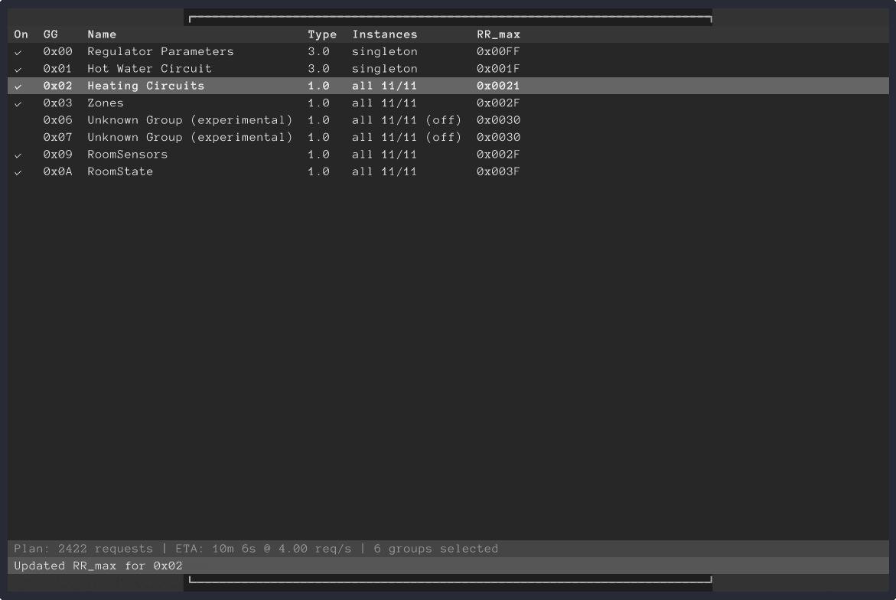
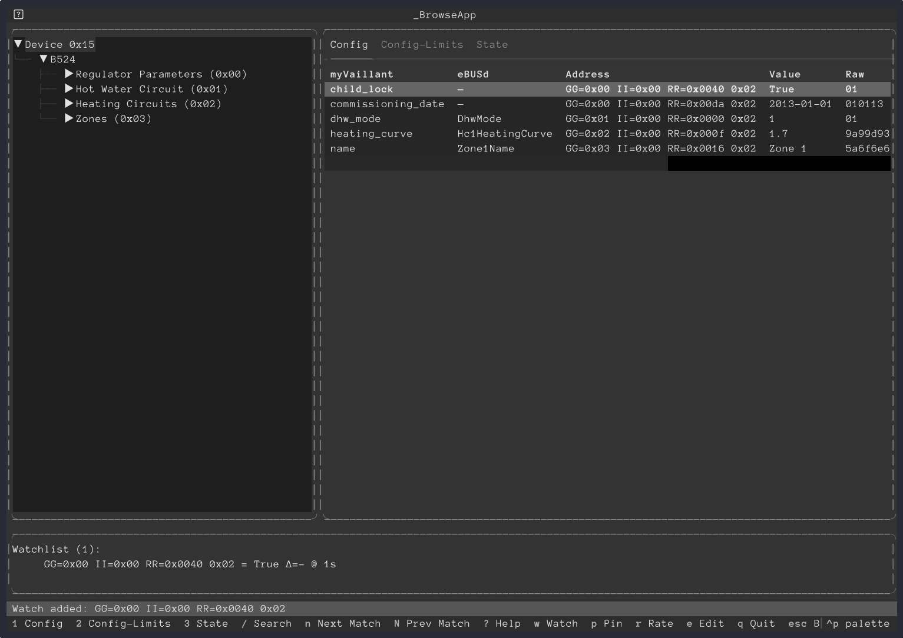

# helianthus-vrc-explorer

[](https://github.com/d3vi1/helianthus-vrc-explorer/actions/workflows/ci.yml)

Helianthus VRC Explorer is a professional CLI tool for scanning Vaillant VRC heating regulators via eBUS (B5 24 / B524 GetExtendedRegisters). It focuses on safe, read-oriented discovery and produces a high-quality JSON artifact.

## Goals
- Scan VRC regulators using the B524 protocol family (groups, instances, registers).
- Provide a polished terminal experience (rich formatting, progress, summaries).
- Produce complete JSON artifacts with metadata.
- Keep non-code assets (CSV/JSON fixtures, schemas) as editable data files, not hardcoded into Python.
- CI-gated development: lint + format + tests for every PR.

## Non-goals (for now)
- Shipping a full Home Assistant integration from this repository.
- Writing to devices by default. Any write/control functionality must be explicit and reviewed.

## Quick start
```bash
python -m helianthus_vrc_explorer scan \
  --host 127.0.0.1 \
  --port 8888 \
  --planner-ui auto \
  --preset recommended
```

`scan` auto-discovers the destination (`--dst auto`) by default. Use `--dst 0x..` to force an address.

Key scan UX flags:
- `--planner-ui auto|textual|classic`
- `--preset conservative|recommended|aggressive|custom`
- `--probe-constraints` (optional opcode `0x01` GG/RR probe; off by default)
- `--no-tips`
- `--trace-file /path/to/trace.log`
- `--ebusd-csv-path /path/to/15.720.csv`
- `--myvaillant-map-path /path/to/myvaillant_register_map.csv`

If startup fails on default transport (`tcp://127.0.0.1:8888`) in an interactive TTY, scan opens a retry dialog so you can adjust protocol/host/port and retry or cancel.

Output:
- JSON artifact: `b524_scan_0x??_<timestamp>.json`
- HTML report: `b524_scan_0x??_<timestamp>.html`
- Interactive terminals: after scan, the new fullscreen browse UI opens automatically (`q` to exit back to summary).

Browse a saved artifact in fullscreen Textual UI:
```bash
python -m helianthus_vrc_explorer browse --file b524_scan_0x15_<timestamp>.json
```

Enable safe write mode in browse UI:
```bash
python -m helianthus_vrc_explorer browse \
  --file b524_scan_0x15_<timestamp>.json \
  --allow-write
```

## Features
- Session preface with regulator identity and transport endpoint.
- Phased scanner progress: Group Discovery, Instance Discovery, Register Scan.
- Optional phased `0x01` constraint probing (`Constraint Probe`) when explicitly enabled.
- Interactive planner (`textual` or classic) with presets and per-group overrides.
- Register decoding with raw payload retention and TT/metadata annotations in JSON.
- Auto-generated HTML report alongside JSON scan output.
- Fullscreen register browser with tree navigation by category/group/instance/register.
- Tabbed register views: `Config`, `Config-Limits`, `State`.
- Watch/pin/rate controls and safe write workflow (`--allow-write` + confirmation).

## Scan UI Preview
<picture>
  <source srcset="artifacts/readme/preview.gif" type="image/gif">
  
</picture>

Capture first 5 minutes of autorun, sped up 10x (300s -> 30s):

```bash
./scripts/capture_tui_preview.sh --capture-seconds 300 --speedup 10
```

## Planner UI Preview
<picture>
  <source srcset="artifacts/readme/planner.gif" type="image/gif">
  
</picture>

```bash
./scripts/capture_planner_preview.sh
```

## Browse UI Preview
<picture>
  <source srcset="artifacts/readme/browse.gif" type="image/gif">
  
</picture>

```bash
./scripts/capture_browse_preview.sh
```

Preview script options (all three capture scripts):
- `--output-seconds 45` override final animation duration.
- `--cols 132 --rows 40` tune terminal geometry.
- `--poster-percent 40` choose which moment becomes `<name>.png`.
- `--command "python -m helianthus_vrc_explorer ..."` capture a different run.
- `--font-path "/path/to/Anonymous Pro.ttf"` force font selection.

Dependencies for preview generation:
- `asciinema`
- `agg`
- `expect`
- `Pillow` (available in project dev environment)

## Development
Requirements: Python 3.12+

```bash
python -m venv venv
source venv/bin/activate

pip install -e ".[dev]"
ruff check .
ruff format .
pytest
```

## Data files
If you need to add or update non-code data (schemas, fixtures, CSV/JSON dumps), keep it as data under `data/` so non-programmers can review and edit it via PRs.

## License
GPL-3.0-or-later. See `LICENSE`.
