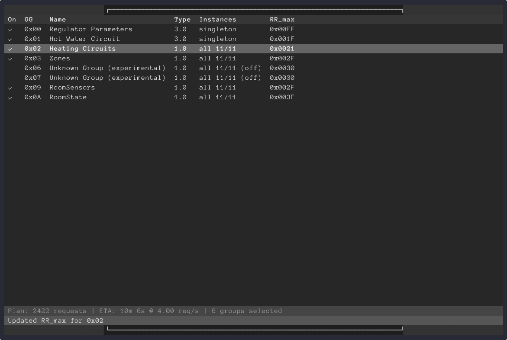
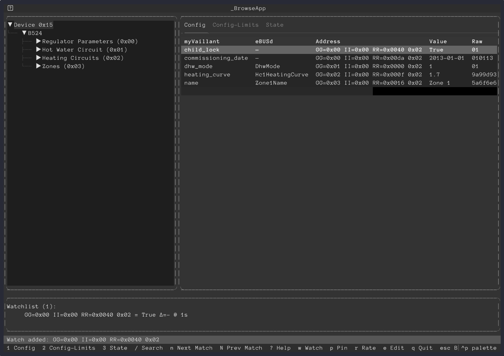

# helianthus-vrc-explorer

[](https://github.com/Project-Helianthus/helianthus-vrc-explorer/actions/workflows/ci.yml)

Helianthus VRC Explorer is a professional CLI tool for scanning **Vaillant VRC-series heating regulators/controllers** (e.g. VRC 700/720) via eBUS (B5 24 / B524 GetExtendedRegisters). It focuses on safe, read-oriented discovery and produces a high-quality JSON artifact.

This repository has **no relation to VRChat**.

## Goals
- Scan VRC regulators using the B524 protocol family (groups, instances, registers).
- Provide a polished terminal experience (rich formatting, progress, summaries).
- Produce complete JSON artifacts with metadata.
- Keep non-code assets (CSV/JSON fixtures, schemas) as editable data files, not hardcoded into Python.
- CI-gated development: lint + format + tests for every PR.

## Non-goals (for now)
- Shipping a full Home Assistant integration from this repository.
- Writing to devices by default. Any write/control functionality must be explicit and reviewed.

## Prerequisites
You need a working eBUS stack before this tool can talk to a regulator:

`Vaillant VRC regulator on eBUS` -> `eBUS adapter` -> `ebusd daemon` -> `helianthus-vrc-explorer`

Minimum setup:
- A supported eBUS-to-host adapter (hardware), wired to your eBUS.
- `ebusd` installed, running, and reachable over TCP (defaults to `127.0.0.1:8888`).
- `ebusd` must have the `hex` command enabled (`--enablehex`), since this tool uses raw telegram exchange.
- Network reachability from the machine running this tool to the `ebusd` TCP endpoint.

## Who Is This For?
- Home automation users and integrators who already have `ebusd` working and want a **safe, read-first** register explorer.
- Contributors reverse-engineering Vaillant VRC-series behavior and building mappings/decoders from real scans.

## Quick start
```bash
python -m helianthus_vrc_explorer scan \
  --planner-ui auto \
  --preset recommended
```

`scan` auto-discovers the destination (`--dst auto`) by default. Use `--dst 0x..` to force an address.

Namespace contract for implementers:
- Stable B524 namespace invariants (identity, discovery authority, constraint scope, artifact keys, fixture compatibility): [`docs/b524-namespace-invariants.md`](docs/b524-namespace-invariants.md)
- This README remains user-facing; invariant-level semantics are documented in the file above once implementation behavior is stable.

Key scan UX flags:
- `--planner-ui auto|textual|classic`
- `--preset conservative|recommended|full|custom`
- `--probe-constraints` (optional live opcode `0x01` GG/RR rescan; off by default and research-only)
- `--b509-dump` (B509 is opt-in; `--b509-range` requires this flag)
- `--no-tips`
- `--redact` (redact identity fields like serial number from console output)
- `--trace-file /path/to/trace.log`
- `--ebusd-csv-path /path/to/15.720.csv` (optional enrichment: adds eBUSd register names)
- `--myvaillant-map-path /path/to/myvaillant_register_map.csv` (optional enrichment: adds myVaillant-style leaf names)

If startup fails on default transport (`tcp://127.0.0.1:8888`) in an interactive TTY, scan opens a retry dialog so you can adjust protocol/host/port and retry or cancel.

Transport note:
- On shared live `ebusd-tcp` setups, the first B524 directory probe (`GG=0x00`) can transiently return a status-only `00`. The scanner treats this as transient noise and continues discovery instead of declaring B524 unsupported immediately.
- On `ebusd-tcp`, `ERR: timeout`, `ERR: arbitration lost`, `ERR: SYN received`, and `ERR: wrong symbol received` now trigger a fixed 5-second quiet backoff before retry so the bus can settle.
- On `ebusd-tcp`, `ERR: no signal` now triggers a fixed 15-second quiet backoff before retry so the eBUS side can recover instead of being polled aggressively.
- Classic GG directory-probe results are retained as advisory metadata for semantic identity and namespace topology. They are useful evidence for reverse-engineering and debugging, but they do not define those semantics once a group is a scan candidate (see `docs/b524-namespace-invariants.md`). A `descriptor_type == 0.0` result is still used as a discovery-time negative hint for non-core/unknown groups in Phase A.
- Instance availability is namespace-specific. Dual-namespace radio groups (`0x09`, `0x0A`) are discovered independently per opcode namespace instead of sharing remote results across local and remote.
- Artifacts retain the availability contract plus raw per-slot probe evidence under `availability_contract` and `availability_probes`, including the opcode `0x06` generic header block (`RR=0x0001..0x0004`) used for remote namespace occupancy.
- Empty ACK / 0-byte B524 register replies are preserved as `response_state="empty_reply"` (rendered as “empty reply / dormant”), not as transport errors.
- B524 register replies expose protocol-level `reply_kind` annotations derived from the DT byte (`RK`, effective 2-bit domain `0..3`).
  - `OP=0x02`: bit1=config, bit0=volatile/stable (`simple_volatile`, `simple_stable`, `config_volatile`, `config_stable`)
  - `OP=0x06`: bit1=config, bit0=invalid/valid (`simple_invalid`, `simple_valid`, `config_invalid`, `config_valid`)
- OP `0x06` register-map fallbacks include a generic device header for `RR=0x0001..0x0004`, but BASV2 heat-source inventory is 1-indexed on `GG=0x01` (primary / type 1) and `GG=0x02` (secondary / type 2). `GG=0x00` is local-only on BASV2.
- GG `0x09` is intentionally dual-use: local/control semantics on `0x02`, remote radio-device semantics on `0x06`.
- Scanner annotations include the integer sentinel `0x7FFFFFFF` as `value_display="sentinel_invalid_i32 (0x7FFFFFFF)"` when decoded in integer contexts.
- Unknown groups are namespace-classified from live opcode responsiveness evidence. There is no implicit unknown-group `[0x02, 0x06]` fallback.
- Contextual enum annotations are local-namespace scoped: group `0x02` local (`0x02`) register context never relabels remote (`0x06`) entries.
- Canonical namespace identity is always an opcode hex key (`0x02`, `0x06`, ...). Labels like `local`/`remote` are presentation metadata only.
- Browse UI, CLI summary, and HTML report derive namespace labels from opcode identity and render them as qualified displays (for example `Local (0x02)`, `Remote (0x06)`).
- Legacy artifacts that still carry mixed opcodes inside a single non-dual group are rendered per-namespace in browse/report surfaces to prevent local/remote intermixing and override bleed.
- Persisted `groups[*].dual_namespace` topology is authoritative for consumers. Do not infer or rewrite namespace shape from descriptors.
- B524 browse/report row identity is namespace-aware even for single-namespace groups: dedupe key `<group>:<namespace>:<instance>:<register>` and path format `B524/<group-name>/<namespace-display>/<instance>/<register-name>` are round-trip stable.
- Artifact schema contract is versioned (`schema_version: "2.2"` current). Readers keep backward compatibility by migrating unversioned, `2.0`, and `2.1` artifacts in-memory.
- CI enforces these rules with `python scripts/check_b524_namespace_guardrails.py`.

Constraint note:
- Normal scans use a bundled static BASV2 constraint catalog and flag values that fall outside it.
- `--probe-constraints` is a separate live rescan path for opcode `0x01`; it can add hundreds of extra requests and should only be used when you need to confirm a mismatch or do research work.
- Constraint scope decision: `opcode_0x02_default`. The bundled static catalog is seeded from opcode `0x01` probe evidence, but it is only applied to opcode `0x02` by default. Remote opcode `0x06` requires explicit scope or live confirmation via `--probe-constraints`.
- Artifacts record this decision in `meta.constraint_scope` and per-entry fields (`constraint_scope`, `constraint_provenance`) so report/UI consumers do not guess scope semantics.
- `--preset full` is intentionally expensive: it expands all instance slots and full RR ranges and can take hours on BASV2.

Output:
- JSON artifact: `b524_scan_0x??_<timestamp>.json`
- HTML report: `b524_scan_0x??_<timestamp>.html`
- Interactive terminals: after scan, the new fullscreen browse UI opens automatically (`q` to exit back to summary).

Browse a saved artifact in fullscreen Textual UI:
```bash
python -m helianthus_vrc_explorer browse --file b524_scan_0x15_<timestamp>.json
```

Enable safe write mode in browse UI:
```bash
python -m helianthus_vrc_explorer browse \
  --file b524_scan_0x15_<timestamp>.json \
  --allow-write
```

### Write Safety
By default the tool is **read-only**.

`scan` is always read-only.

`browse --allow-write` enables edit actions in the fullscreen UI, and requires per-write confirmation
(old value -> new value -> confirm).

In `browse --file` mode, edits do **not** write to the device (they only update the UI view). Live
device writes are planned.

## Features
- Session preface with regulator identity and transport endpoint.
- Phased scanner progress: Group Discovery, Instance Discovery, Register Scan.
- Bundled static BASV2 constraint catalog with mismatch warnings in scan artifacts and summaries.
- Optional live `0x01` constraint probing (`Constraint Probe`) when explicitly enabled.
- Interactive planner (`textual` or classic) with presets and per-group overrides.
- Register decoding with raw payload retention and TT/metadata annotations in JSON.
- Auto-generated HTML report alongside JSON scan output.
- Fullscreen register browser with tree navigation by category/group/instance/register.
- Tabbed register views: `Config`, `Config-Limits`, `State`.
- Watch/pin/rate controls and safe write workflow (`--allow-write` + confirmation).

## Data Enrichment Sources (Optional)
This tool can enrich raw scan output with human-readable names:
- **myVaillant map** (`--myvaillant-map-path`): a small curated CSV mapping `(GG,II,RR)` to myVaillant-style leaf names.
  - Default: bundled in this repo as `data/myvaillant_register_map.csv` (also packaged under `src/helianthus_vrc_explorer/data/`).
  - Opcode-aware namespace policy: `0x06` mappings must be explicit; generic opcode-less fallback rows are local `0x02` defaults only.
- **eBUSd CSV schema** (`--ebusd-csv-path`): adds register names from an eBUSd configuration CSV (e.g. `15.720.csv`).
  - Source: typically taken from an `ebusd-configuration` checkout (not bundled here).

## Scan UI Preview
<picture>
  <source srcset="artifacts/readme/preview.gif" type="image/gif">
  
</picture>

Capture first 5 minutes of autorun, sped up 10x (300s -> 30s):

```bash
./scripts/capture_tui_preview.sh --capture-seconds 300 --speedup 10
```

## Planner UI Preview
<picture>
  <source srcset="artifacts/readme/planner.gif" type="image/gif">
  
</picture>

```bash
./scripts/capture_planner_preview.sh
```

## Browse UI Preview
<picture>
  <source srcset="artifacts/readme/browse.gif" type="image/gif">
  
</picture>

```bash
./scripts/capture_browse_preview.sh
```

Preview script options (all three capture scripts):
- `--output-seconds 45` override final animation duration.
- `--cols 132 --rows 40` tune terminal geometry.
- `--font-size 18` control render font size (pixels).
- `--poster-percent 40` choose which moment becomes `<name>.png`.
- `--command "python -m helianthus_vrc_explorer ..."` capture a different run.
- `--font-path "/path/to/Anonymous Pro.ttf"` force font selection.

Dependencies for preview generation:
- `asciinema`
- `agg`
- `expect`
- `Pillow` (available in project dev environment)

## Development
Requirements: Python 3.12+

```bash
python -m venv venv
source venv/bin/activate

pip install -e ".[dev]"
ruff check .
ruff format .
pytest
```

## Data files
If you need to add or update non-code data (schemas, fixtures, CSV/JSON dumps), keep it as data under `data/` so non-programmers can review and edit it via PRs.

## License
GPL-3.0-or-later. See `LICENSE`.
